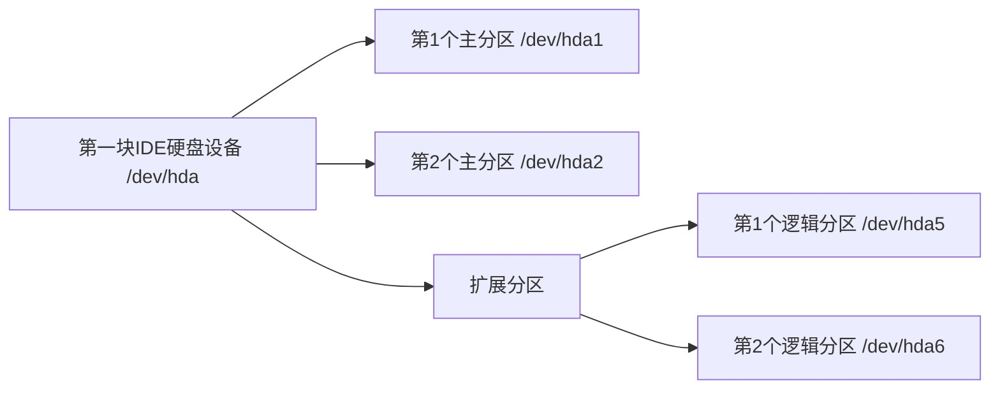

# Linux系统的介绍

在这之前，先来介绍下服务端操作系统的“老大哥”——Unix

Unix是由美国电话电报公司（AT&T）贝尔实验室的两个工程师所创造的操作系统，它允许计算机同时处理多用户和程序。目前大型政府单位、航空公司、金融机构都在使用，价钱昂贵，但性能和稳定性也相当地好。
PS：Unix一般与硬件配套售卖。

> Linux操作系统的诞生、发展和成长过程始终依赖着五个重要支柱：Unix操作系统、MINIX操作系统、GNU计划、POSIX标准和Internet网络。
> 20世纪80年代，计算机硬件的性能不断提高，PC的市场不断扩大，当时可供计算机选用的操作系统主要有Unix、DOS和macOS这几种。Unix价格昂贵，不能运行于PC；DOS显得简陋，且源代码被软件厂商严格保密；MacOS是一种专门用于苹果计算机的操作系统。此时，计算机科学领域迫切需要一个更加完善、强大、廉价和完全开放的操作系统。由于供教学使用的典型操作系统很少，因此当时在荷兰当教授的美国人AndrewS.Tanenbaum编写了一个操作系统，名为MINIX，为了向学生讲述操作系统内部工作原理。MINIX虽然很好，但只是一个用于教学目的的简单操作系统，而不是一个强有力的实用操作系统，然而最大的好处就是公开源代码。全世界学计算机的学生都通过钻研MINIX源代码来了解电脑里运行的MINIX操作系统，芬兰赫尔辛基大学大学二年级的学生Linus Torvalds就是其中一个，在吸收了MINIX精华的基础上，Linus于1991年写出了属于自己的Linux操作系统，版本为Linux0.01，是Linux时代开始的标志。他利用Unix的核心，去除繁杂的核心程序，改写成适用于一般计算机的x86系统，并放在网络上供大家下载，1994年推出完整的核心Version1.0，至此，Linux逐渐成为功能完善、稳定的操作系统，并被广泛使用。
> 引用自——百度百科

> 注：Minix是一种基于微内核架构的类UNIX计算机操作系统，于1987年由Andrew S. Tanenbaum教授发布，它启发了Linux。

## 什么是Linux

* 可以运行在PC机上，类似于Unix风格的操作系统
* 由众多程序员通过Internet协作开发
* Linux是开源的（Open Source)

## 开放源代码的好处

自由软件（Free Software）的定义是“自由”的软件而不是“免费”的软件。近年被倡导者改用“Open Source”（开放源码）的名词和定义取代，以免常常误会为“免费”软件。

自由软件即表示使用者拥有：
使用的自由——可以不受任何限制的来使用软件
研究的自由——可以研究软件运作方式，并使其适合个人需求
散布的自由——可以自由的复制此软件并散布给他人
改良的自由——可以自行改良软件并散布改良后的版本

## Linux Logo为什么是企鹅

Linux的作者Linus是芬兰人，而芬兰的吉祥物就是一只可爱的企鹅，所以Linux的代言就是一只憨厚可爱的企鹅。

> 另一种说法：
> 企鹅是南极洲的标志性动物，根据国际公约，南极洲为全人类共同所有，不属于世界上的任何国家，可国家都无权将南极洲纳入其版图。
> Linux 选择企鹅图案作为 Logo，其含义是：开放源代码的 Linux 为全人类共同所有，可公司无权将其私有。

## Linux发展

<font color=#3232CD><i>1991年10月5日</i></font>
第一个版本0.0.2发布
代码只有约10,000行

<font color=#3232CD><i>1992年</i></font>
Linux0.96拥有40,000行代码
大约有1000人在使用，大部分是hacker

<font color=#3232CD><i>1993年</i></font>
Linux0.99发布
大约100余名程序员参与内核代码编写/修改
代码量约有10万行，用户约有2万
采用GNU的GPL协议发布，从此获得迅速发展

# Linux系统结构

* Linux操作系统由内核及应用程序组成
* 不同的厂商根据各自的需要将各种应用软件和Linux内核一起打包即成为一个Linux发行版本（distribution）

## Linux常见发行版本

* RedHat Linux
* SuSE Linux
* Ubuntu Linux
* Mandrake Linux
* Caldera Linux
* Turbolinux
* Debian GNU/Linux
* Gentoo Linux
* Linpus Linux

# Linux现状

* 早期的Linux主要用来提供网络基础服务
* 打印、文件服务、DNS、DHCP、HTTP等
* 经过十多年的发展Linux的应用已经从网络扩展到几乎所有IT领域
* 数据库、ERP、决策支持
* 企业级Office、电子商务软件、网络管理
* RAS（可靠性、可用性和可服务性）计算
* 计算机辅助设计制造（CAD/CAM）
* 电影特技模拟

## Linux在企业和政府中的应用

* 大部分大型互联公司都在使用Linux提供Web服务
*新浪网、赛迪网等都采用了Linux操作系统*
* Google用十万台Linux计算机提供搜索服务
* QQ也靠Linux的服务器
* NEC、摩托罗拉、 诺基亚和三星都有Linux手机
* 全球最大网上书店亚马逊使用的是Linux平台
* SONY的PS游戏机其实骨子里就是Linux
* 中国国家邮政局全面信赖Linux平台
* 德国慕尼黑市政府的14000台计算的操作系统是Linux
* 美国的天气预报现在靠Linux系统

# Linux系统的安装

## Linux内核版本

* 由Linux内核项目团体统一进行发布

**XX.YY.ZZ**

X 表示主版本号
Y 表示次版本号
Z 表示更新/打补丁的次数

For example：
2.5.7
2.6.18

次版本号为奇数，代表开发版本；偶数则为稳定版本

## 磁盘分区表示

* Linux中将硬盘、分区等设备均表示为文件

`/dev/hda5`

dev 表示硬件设备文件所在的目录
hd 表示IDE设备
> IDE(Integrated-Drive-Electronics)是现在普遍使用的外部接口，主要接硬盘和光驱。采用16位数据并行传送方式，体积小，数据传输快。一个IDE接口只能接两个外部设备。
sd 表示SCSI设备
> 小型计算机系统接口（英语：Small Computer System Interface; 简写：SCSI），一种用于计算机和智能设备之间（硬盘zhuan、软驱、光驱、打shu印机、扫描仪等）系统级接口的独立处理器标准。 SCSI是一种智能的通用接口标准。
a 为硬盘的顺序号，以字母a、b、c …… 表示
5 为分区的顺序号，以数字1、2、3 …… 表示
> 这里的5表示逻辑分区。
> 主分区，也称为主磁盘分区，和扩展分区、逻辑分区一样，是一种分区类型。主分区中不能再划分其他类型的分区，因此每个主分区都相当于一个逻辑磁盘（在这一点上主分区和逻辑分区很相似，但主分区是直接在硬盘上划分的，逻辑分区则必须建立于扩展分区中）。
> 逻辑分区是硬盘上一块连续的区域，不同之处在于，每个主分区只能分成一个驱动器，每个主分区都有各自独立的引导块，可以用fdisk设定为启动区。一个硬盘上最多可以有4个主分区，而扩展分区上可以划分出多个逻辑驱动器。这些逻辑驱动器没有独立的引导块，不能用fdisk设定为启动区。主分区和扩展分区都是dos分区。
> 早期MBR模式分区只能划分四个分区，现在的GPT分区至少可以划分128个主分区，未来很有可能将不存在扩展分区和逻辑分区的概念。

### 硬盘和分区结构



PS：Linux的逻辑分区是从 5 开始算的

Question：
第2块SCSI硬盘的第3个逻辑分区如何表示？
!!/dev/sdb7!!

## 文件系统类型

* Linux中默认使用的文件系统类型
EXT3：第3代扩展（Extended）文件系统
SWAP：交换文件系统

* Linux支持的其他文件系统类型
FAT16、FAT32、NTFS、XFS、JFS等

## Linux安装实践

略（自行网上搜索安装教程）

[Linux—root密码丢失重置](https://blog.csdn.net/niufenger/article/details/80314386)

可能遇到的问题：[安装VMware Tools选项显示灰色的正确解决办法](https://blog.csdn.net/qq_40259641/article/details/79022844)

## Linux的目录结构

/Bin：
全称Binaries，意思为“二进制”。该目录储存的均为二进制文件，文件都是可被执行。目录下存放着经常使用的命令。

/boot：
该目录存放启动Linux时使用的核心文件，包括连接文件以及镜像文件。

/dev：
全称Device，意思为“设备”。存放的是外接设备文件，（包括硬盘、分区、键盘、鼠标、USB等） 只要通过存取这个目录下的某个档案，就等于存取某个装置。在 Linux 中访问设备的方式和访问文件的方式是相同的。

/etc：
全称为Etcetera，意思为“等等”。该目录用来存放所有的系统管理所需要的配置文件和子目录。

/home：
用户的主目录，在 Linux 中，每个用户都有一个自己的目录，一般该目录名是以用户的账号命名的。

/lib：
全称为Library，这里意思为“库”。该目录存放着系统最基本的动态连接共享库，其作用类似于 Windows 里的 dll 文件。

/media：
linux 系统会自动识别一些可移除的设备，例如U盘、光驱等等，当识别后，Linux 会把识别的设备挂载到这个目录下。

/mnt：
全称mount，这里意思为“挂载”。如果想要临时挂载某些额外的设备，一般建议放置到这个目录中。早期，该目录的用途与/media相同。有了/media之后，这个目录就用来作暂时挂载了。如：我们可以将光驱挂载在/mnt上，然后进入该目录就可以查看光驱里的内容了。

/opt：
全称optional，这里意思为“可选”。这里主要存放那些可选的程序。
你想尝试最新的firefox测试版吗？那就装到/opt目录下吧， 这样，当你尝试完，想删掉firefox的时候，你就可 以直接删除它，而不影响系统其他任何设置。 安装到/opt目录下的程序，它所有的数据、库文件等等都是放在同个目录下面。
举个例子：刚才装的测试版firefox，就可以装到/opt/firefox_beta目录下，/opt/firefox_beta目录下面就包含了运 行firefox所需要的所有文件、库、数据等等。要删除firefox的时候，你只需删除/opt/firefox_beta目录即可，非常简单。

/proc：
proc 是 Processes(进程) 的缩写，/proc 是一种伪文件系统（也即虚拟文件系统），存储的是当前内核运行状态的一系列特殊文件，这个目录是一个虚拟的目录，它是系统内存的映射，我们可以通过直接访问这个目录来获取系统信息。

/root：
系统管理员(root)的主目录。 之所以放在这里，是因为如果进入单人维护模式而仅挂载根目录时，该目录就能够拥有root的主目录，所以我们会希望root的主目录与根目录放置在同一个分区中。

/run：
临时文件系统，存储系统启动以来的信息。当系统重启时，这个目录下的文件应该被删掉或清除。如果你的系统上有 /var/run 目录，应该让它指向 run。

/sbin：
全称Superuser Binaries，意思为“超级用户的二进制文件”。这里存放的是系统管理员使用的系统管理程序。

/srv：
全称Services，意为“服务”。该目录存放一些服务启动之后需要提取的数据。

/sys：
全称System，意为“系统”。顾名思义。

/tmp：
全称为Temporary，意为“临时”。该目录是用来存放一些临时文件的。该目录任何人都能够存取，所以需要定期清理。重要资料不可放置在此目录。

/usr：
全称**Unix System Resources**，意为“Unix操作系统软件资源”。这是一个非常重要的目录，用户的很多应用程序和文件都放在这个目录下，类似于 Windows 下的 Program Files 目录。
> In the original Unix implementations, /usr was where the home directories of the users were placed (that is to say, /usr/someone was then the directory now known as /home/someone). In current Unices, /usr is where user-land programs and data (as opposed to 'system land' programs and data) are. The name hasn't changed, but it's meaning has narrowed and lengthened from "everything user related" to "user usable programs and data". As such, some people may now refer to this directory as meaning 'User System Resources' and not 'user' as was originally intended. (链接：https://tldp.org/LDP/Linux-Filesystem-Hierarchy/html/usr.html)

/var：
全称Variable，意为“变量”。该目录中存放着在不断扩充着的东西，我们习惯将那些经常被修改的目录放在这个目录下，包括各种日志文件。  

相关文章：
[Linux /opt和/usr文件夹说明](https://www.cnblogs.com/larry2016/p/13977297.html)  
[Linux /proc目录详解](https://www.cnblogs.com/DswCnblog/p/5780389.html)  
[Linux中/bin与/sbin目录的作用及区别介绍](https://blog.csdn.net/lh2016rocky/article/details/70801030)  
[关于linux下/srv、/var和/tmp的职责区分](https://blog.csdn.net/u012107143/article/details/54972544)  
[Linux 内核/sys 文件系统介绍](https://blog.csdn.net/runner668/article/details/80685940)  
[linux中/usr的由来及内容](https://blog.csdn.net/menogen/article/details/12185685)  
[Linux中常见的英文缩写](https://www.zhihu.com/question/49073893/answer/114438355)  

# Linux相关命令

[Linux基础](https://blog.csdn.net/weixin_44440734/article/details/86564309)  
[Linux ls 命令](https://www.runoob.com/linux/linux-comm-ls.html)  
[Linux—vi命令详解](https://blog.csdn.net/cyl101816/article/details/82026678)  
[chmod命令详细用法](https://www.cnblogs.com/chengJAVA/p/4319420.html)  
[Linux rpm命令详解](https://www.cnblogs.com/ftl1012/p/rpm.html)  
[Linux yum 命令](https://www.runoob.com/linux/linux-yum.html)  
[Linux下源码编译安装的三个步骤](http://www.05bk.com/231.html)  
[Linux源码安装步骤(详细)](https://www.cnblogs.com/benwu/articles/8436209.html)  
[apt命令](https://www.cnblogs.com/Jimc/p/10297719.html)  
[dpkg命令](https://www.cnblogs.com/Jimc/p/10302347.html)  

# 用Linux搭建Apache+MySQL+php网站（基于CentOS 7.0）

1. 安装 httpd（Apache），php，mysql，php-mysql：

```bash
yum -y install httpd php mysql php-mysql
```

2. 安装mysql-server：

依次执行以下命令：

```bash
wget http://repo.mysql.com/mysql57-community-release-el7-10.noarch.rpm
```

```bash
rpm -Uvh mysql57-community-release-el7-10.noarch.rpm
```

```bash
yum -y install mysql-server
```

3. 启动httpd服务

```bash
systemctl start httpd.service
```

检查httpd服务启动情况

```bash
ps -aux | grep httpd
```

检查httpd服务状态

```bash
systemctl status httpd.service
```

4. 启动MySQL服务

```bash
service mysqld start
```

5. 设置MySQL数据库root账号密码并登录

```bash
mysqladmin -uroot -password 123456
mysql -uroot -p123456
```

6. 配置MySQL数据库
具体情况具体分析，这里省略。

7. 清空防火墙

```bash
iptables -F
```

8. 访问网站（出现测试页面）
本机浏览器访问`http://127.0.0.1/`
其他计算机浏览器访问`http://192.168.xxx.xxx/`(搭建服务器的计算机ip地址)

* 建议：将`/var/www`目录及其子目录下所有文件的拥有者改为apache，执行如下命令：

```bash
chown -R apache /var/www
```

Apache是程序用户，访问网站时会用到。

9. 在`/var/www/html`目录放入网站文件，再次访问网站
网站页面正常显示后，登录管理员账号，修改数据库参数（未创建数据库，新建一个即可），设置完成后返回主页面。

以上。

相关文章：
[Linux服务器上搭建Centos7.0+Apache+php+Mysql网站](https://www.cnblogs.com/skkip/p/9998112.html)  
[Linux服务器配置（详细版）](https://blog.csdn.net/weixin_44944193/article/details/102928254)  
[CenterOS7中解决No package mysql-server available.](https://www.cnblogs.com/heyongboke/p/11016561.html)  
[systemctl start xxxxx.service命令无法正常启动服务](https://blog.csdn.net/baidu_41847368/article/details/115130770)  
[SQL语法](https://www.runoob.com/sql/sql-intro.html)  
[mysql命令-use](https://www.cnblogs.com/hwaggLee/p/5010135.html)  
[iptables详解（1）：iptables概念](https://www.zsythink.net/archives/1199)  
[iptables入门指南](https://www.cnblogs.com/liang2580/articles/8400140.html)  
[iptables 执行清除命令 iptables -F 要非常小心](https://blog.csdn.net/dabao87/article/details/81064113)  
[Linux防火墙执行清除命令iptables -F说明](https://www.jingxialai.com/1535.html)  
[Linux chown 命令](https://www.runoob.com/linux/linux-comm-chown.html)  
